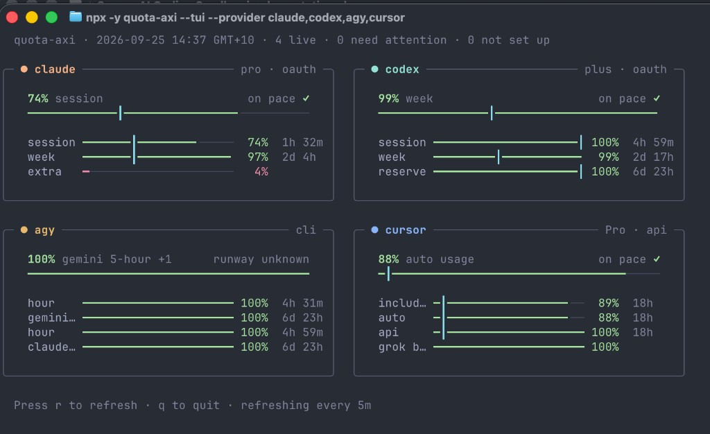

# agent-toolkit

Curated Agent Skills for Claude Code, Cursor, Codex CLI, and Antigravity CLI.

## Install

```bash
npx skills@latest add olibyte/agent-toolkit \
  -a claude-code -a cursor -a codex -a antigravity -a antigravity-cli -y
```

Install into the project. A local clone uses the clone path in place of `olibyte/agent-toolkit`.

Copy `templates/AGENTS.md` and `templates/CLAUDE.md` to the repo root when those files are missing. Copy `templates/models.md` to `.agents/models.md` when you want to pin subagent models.

Commit `.agents/skills/`, `.claude/skills/`, `skills-lock.json`, `AGENTS.md`, and `CLAUDE.md`. Leave `.agents/models.md` uncommitted when the team does not share models. Run `handoff` before switching tools.

## Poteto mode

Working style from [pstack](https://github.com/cursor/plugins/tree/main/pstack): match a playbook, name the data shape, delegate the implementation, check the real artifact. Casual turns skip it.

Codex: `$poteto-mode`. Claude Code, Cursor, and Antigravity: `/poteto-mode`. Playbooks live in [`skills/poteto-mode/SKILL.md`](skills/poteto-mode/SKILL.md).

## Optional skills

These live under `optional/` so a default Codex session stays small. Drop any `-s` you do not need.

```bash
npx skills@latest add olibyte/agent-toolkit --full-depth \
  -s swarm -s interrogate -s figure-it-out \
  -s create-verification-skill -s maintain-verification-skill \
  -a claude-code -a cursor -a codex -a antigravity -a antigravity-cli -y
```

Invoke as `$name` or `/name`.

- **swarm.** Fan out workers, wait, return one report.
- **interrogate.** Several models review one diff and return a verdict. The diff stays as it is.
- **figure-it-out.** Write a playbook when none fits, then run it.
- **create-verification-skill.** Write a project-local `verify-<app>` skill under `.agents/skills/`.
- **maintain-verification-skill.** Recheck that map against source and a live pass, then open at most one PR of proven corrections.

poteto-mode calls swarm, interrogate, and figure-it-out when they are installed, and skips them with a reason when they are absent.

## Factory

[`factory/`](factory/README.md) runs one coding task on a throwaway worker and ends with a pull request. You write a small task file with the repo, the change (a shell command, or a prompt for Claude Code or Codex), and the checks. The factory clones the repo, makes the change, runs the checks, pushes a branch, and opens the PR. It posts each step to Slack, then deletes the worker.

```bash
node factory/cli.ts run factory/examples/proof.task.json --worker local   # or --worker ec2
```

The local worker needs Node 22.18 or later and `gh`. The EC2 worker also needs an AWS account and Terraform. [`factory/README.md`](factory/README.md) covers setup. The factory is separate from the skills, and `npx skills add` does not install it.

## Recommended: quota-axi

[Kun Chen](https://github.com/kunchenguid)'s [quota-axi](https://github.com/kunchenguid/quota-axi) reports local subscription quota windows (Claude, Codex, Cursor, Copilot, and others) so the agent can see remaining runway before it spends more. The report is data only.



```bash
npx skills@latest add kunchenguid/quota-axi --skill quota-axi -g \
  -a claude-code -a cursor -a codex -a antigravity -a antigravity-cli
```

`-g` installs the skill for every project. Omit it to keep the skill in the current project.

## Other catalogs

One command per source. Leave off `-y` so you can skip skills. Same `-a` flags as above.

- **[mattpocock/skills](https://github.com/mattpocock/skills).** Planning, grilling, specs, and issue trackers. Skip `handoff`, `tdd`, and `teach` (this catalog already ships them), then run `setup-matt-pocock-skills` once.
- **[vercel-labs/agent-skills](https://github.com/vercel-labs/agent-skills).** React and Next.js performance rules and web design audits.
- **[vercel/next.js](https://github.com/vercel/next.js/tree/canary/skills).** Next.js workflows such as `next-dev-loop`. Install only in a Next.js app. Next.js 16.3 and later already writes framework docs into `AGENTS.md`.

```bash
npx skills@latest add <owner/repo> \
  -a claude-code -a cursor -a codex -a antigravity -a antigravity-cli
```

## Spec

- [Agent Skills specification](https://agentskills.io/specification)
- [Vercel Skills CLI](https://github.com/vercel-labs/skills)
